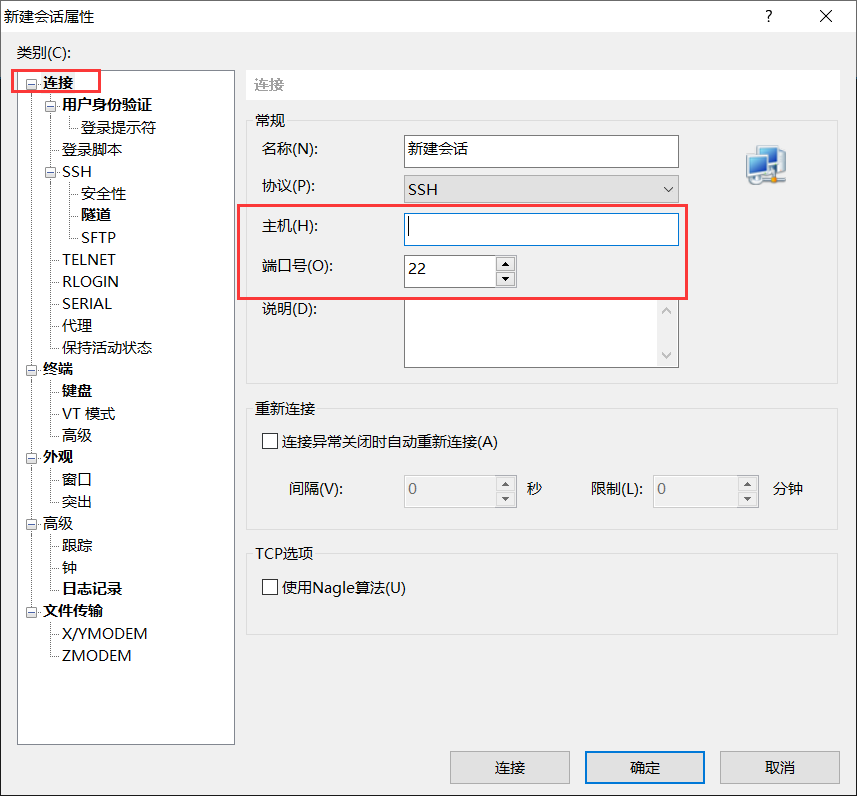
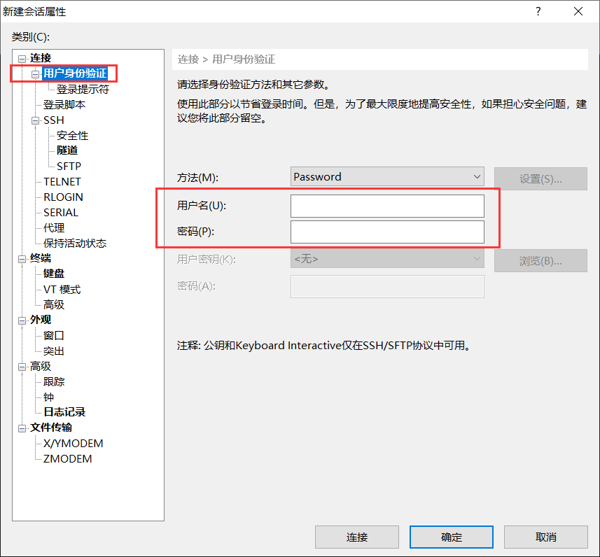
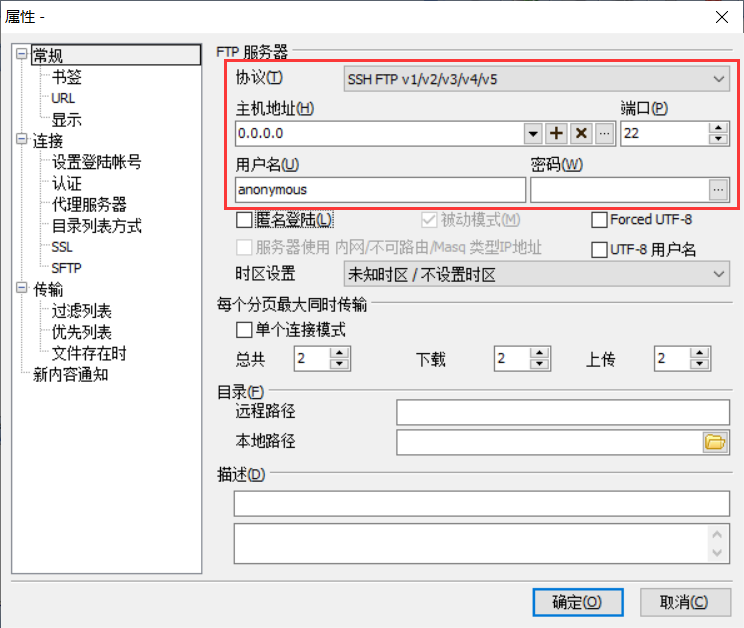

# 租用在线 GPU 服务器

本章介绍两个在线 GPU 租赁服务 MISTGPU 及 1024GPU 的使用方法。

### 概览

|           | MISTGPU           | 1024GPU                 |
| --------- | ----------------- | ----------------------- |
| 机器数量  | 14台              | 31台                    |
| 操作难度  | 较简单            | 较难                    |
| 价位      | 3-6元/小时        | 1-2元/小时              |
| 上传速度  | 中等              | 偏慢                    |
| 仅CPU模式 | 无                | 支持                    |
| 兼容性    | 暂无出现问题      | 有出现过 CuDNN 报错问题 |
| 开具发票  | 满200元可开具发票 | 无                      |
| 余额提现  | 无                | 通过卖出 DBC 获得       |


### 租用流程

|            | MISTGPU                                                      | 1024GPU                                                      |
| ---------- | ------------------------------------------------------------ | ------------------------------------------------------------ |
| 注册和登录 | 使用手机号或邮箱注册                                         | 首次使用获得一个私钥，私钥需自行保管，登录时使用             |
| 充值       | 使用支付宝，人民币结算                                       | 使用区块链钱包，电子货币 DBC 结算，与美元汇率实时浮动。在**我的钱包**点击**如何购买**DBC可使用支付宝购买，购买时钱包地址自动填入，只需点击**继续**完成购买流程。<br />**建议首次充值至少 80000 DBC，其中60000 用于CPU质押，可以减少后续支出**。 |
| 绑定邮箱   | 无                                                           | 必须绑定邮箱，用于接收验证码和SSH信息。                      |
| 租赁CPU    | 无                                                           | 在**机器列表中**挑选可用的机器，使用**质押方式**租赁CPU，交付质押金后可以免费使用CPU。租赁采用预付费方式，可将硬盘调制最低30G，租赁时间建议至少1天。<br />在**我的CPU容器**中支付订单，几分钟后 SSH 将发送至邮箱，根据邮箱的信息将服务器绑定到 SSH 和 FTP 工具（见下文）。<br /> |
| 租赁GPU    | 在**创建服务器**中挑选可用机器，设置密码后即开机使用，使用过程中按分钟扣费。可使用官方提供的在线终端和SCP上传，也可自行使用 SSH工具 和 FTP 工具访问（见下文）。<br />通过 FTP 上传程序和数据后，在 SSH 中运行程序。 | 在 FTP 上完成程序和数据的上传后，可在**我的CPU容器**中开启GPU容器，租赁时间建议至少一天。<br />进入**我的GPU**容器支付后，等待几分钟左右，GPU容器开启（中途CPU容器会被关闭，所以请在上传完所有文件后再开启GPU）。此时CPU的质押金会退回到钱包中。<br />在 SSH 中运行程序。 |
| 运行程序   | 操作见下文。<br />运行过程中请保证余额始终大于0，余额不足时及时充值，一旦余额使用完毕，服务器将直接关闭。 | 操作见下文。<br />运行过程中请关注服务器剩余使用时长，时长不足时需要及时续租。时长用尽，服务器将直接关闭。 |
| 关闭服务器 | 使用完毕后，在**服务器管理**中关闭服务器即可。服务器上的文件和数据保留15天。 | 使用完毕后，在**我的GPU容器**中点击**退租**，输入邮件验证码后即可退租，未使用时长对应的费用将退回至钱包。 |


### SSH 和 FTP 访问

SSH 用于远程访问服务器系统及运行程序任务，基于 SSH 协议的 FTP 可以方便地上传本地文件和下载服务器文件。MISTGPU 的 SSH 信息位于**服务器管理**中，1024GPU 的 SSH 信息则发送至绑定的邮箱。两者提供的 SSH 命令格式如下：

```bash
username@address -p port
```

username、address 和 port 分别对应 SSH/FTP 工具的以下参数：

> 用户名
>
> 服务器（主机）地址
>
> 端口号

其中 1024GPU 还提供一个初始密码，而 MISTGPU 的密码即创建服务器时所设定的密码。

#### SSH 工具

以 **XShell** 为例，设置方法如图所示，在**新建会话**面板中，设置主机地址和端口号，并定义服务器名称（可选）。



在 **用户身份验证** 选项卡中，设置服务器地用户名和密码。



设置完成后，点击**连接**即可使用。

#### FTP工具

以 **FTP Rush** 为例，在菜单栏选择 **工具—快速连接对话框**，设置以下参数，**注意协议需选择为 SSH FTP v1/v2/v3/v4/v5**。



FTP 更多介绍和使用方法参见本文档 [**文件传输服务**](./文件传输服务.md) 一章。


### 运行程序

在 MISTGPU 中运行程序：

```bash
python train.py
```

在 1024GPU 中，默认的为 Python 2，需要显式使用 python3 命令：

```bash
python3 train.py
```


### 并行计算

为充分发挥服务器的性能，可指定程序在加载神经网络时启用多块并行计算，以 PyTorch 为例：

```python
net = Net()
net = nn.DataParallel(net)
net.cuda()
```

启用并行计算时，PyTorch 训练后的模型与直接训练的模型略有不同，需要使用 module 属性提取原始模型。在测试时，先载入原始模型，再开启并行计算。

```python
# train.py
torch.save(net.module.state_dict(),'params.pkl')

# test.py
net = Net()
net.load_state_dict(torch.load('params.pkl'))
net = nn.DataParallel(net)
```

也可以直接保存并行计算后的模型，测试时先开启并行计算然后载入模型。

```python
# train.py
torch.save(net.state_dict(),'params.pkl')

# test.py
net = Net()
net = nn.DataParallel(net)
net.load_state_dict(torch.load('params.pkl'))
```


### 防中断策略

在 SSH 终端运行任务时，若中途终端和服务器断开连接或者终端被意外关闭，前台程序也会相应终止。为了防止长时间任务遭受终端，可使用窗口管理软件 Screen 运行这些任务。Screen 相当于一个常驻于后台的虚拟终端，即时物理终端关闭或断开，虚拟终端仍然不受影响。

运行任务时，使用 screen 命令 + 任务命令即可，如：

```bash
screen python3 train.py
```

若没有安装 screen，可使用 apt 安装：

```bash
sudo apt install screen
```

运行后，可发现任务在一个全屏的窗口中打开，程序打印的信息会显示在这个虚拟窗口中，在使用过程中，可以通过快捷键 Ctrl+a+d 随时退出窗口，程序仍会正常运行。

通过以下命令查询正在运行的窗口

```bash
screen -ls

### Out ###
There is a screen on:
	6632.pts-0.iZuf69navp6ed79hlpf6ylZ	(03/15/2020 02:03:30 PM)	(Detached)
1 Socket in /var/run/screen/S-root.
```

其中 **pts-0** 为窗口的名称，通过 screen -r 命令即可恢复窗口：

```bash
screen -r pts-0
```

在终端和服务器中断或终端意外关闭时，也可以通过这种方法恢复窗口。

窗口运行完毕时，会出现终止提示：

```bash
[screen is terminating]
```

如在运行任务时立即出现终止提示，则可能是命令有误，检查是否出现路径不符等情况。

注意，如果服务器自身因为超时等原因被终止，无法通过此策略恢复任务。