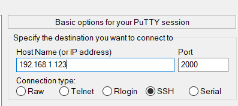
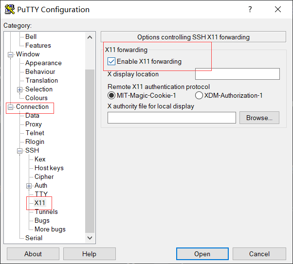
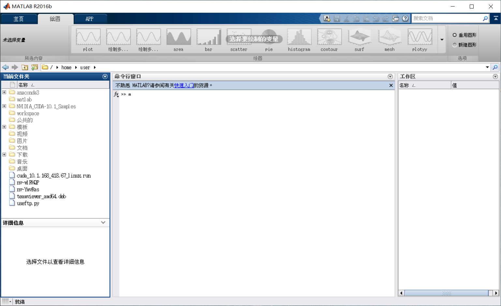

# 4 图形界面转发

使用 Linux 命令行可以完成大多数任务。但某些任务必须使用图形界面，如在 MATLAB 上绘制图表。


## 4.1 为什么不建议使用 TeamViewer

TeamViewer 是当下非常流行的远程桌面控制软件，ILISA 服务器安装了 TeamViewer。您可以使用 TeamViewer 来操控服务器图形界面，但这种做法是不被建议的，因为：

1. TeamViewer 是双向连接的，这意味着如果服务器没有开启 TeamViewer 窗口，您无法使用它；
2. TeamViewer 直接操控与服务器相连的显示器上的界面，这意味着您在操作时，其他人无法使用显示器；
3. 基于第2条原因，您的所有操作将会暴露在显示器上。
4. TeamViewer 控制的界面使用的是公共账号，这意味着您要把数据和文件保存在公共账号中，这种做法是不安全的。


## 4.2 使用 PuTTY + Xming 获取图形界面

> 由于速度和流量限制，本功能不建议通过公网访问使用。

X Window System（也称为 X11）是 Linux 上的图形界面系统，在主机上登录的公共账号，因为与显示器相连，因此启用了此系统。在 SSH 通道中，如果唤起图形界面（如开启 MATLAB 图形界面），X11 会尝试将图形界面转发到客户端。如果本地主机安装了 X Server，那么就会将接收到的界面实时渲染。

在 Windows 系统下，可以使用 Xming 开启 X Server：通过 SSH 工具 PuTTY 将界面转发，并在 Xming 上渲染出来。

> [Xming X Server 下载](https://sourceforge.net/projects/xming/)

>  [PuTTY 下载](https://www.chiark.greenend.org.uk/~sgtatham/putty/latest.html)

安装成功后，直接开启 Xming，Xming 没有界面而直接在后台运行，可以通过托盘图标退出。而后启动 PuTTY，进行 SSH 配置。



同时开启“允许 X11 转发”选项：



连接 SSH，在命令行中启动 matlab：

```
sudo matlab
```

图形界面即开始渲染，最终显示在本地桌面上：



