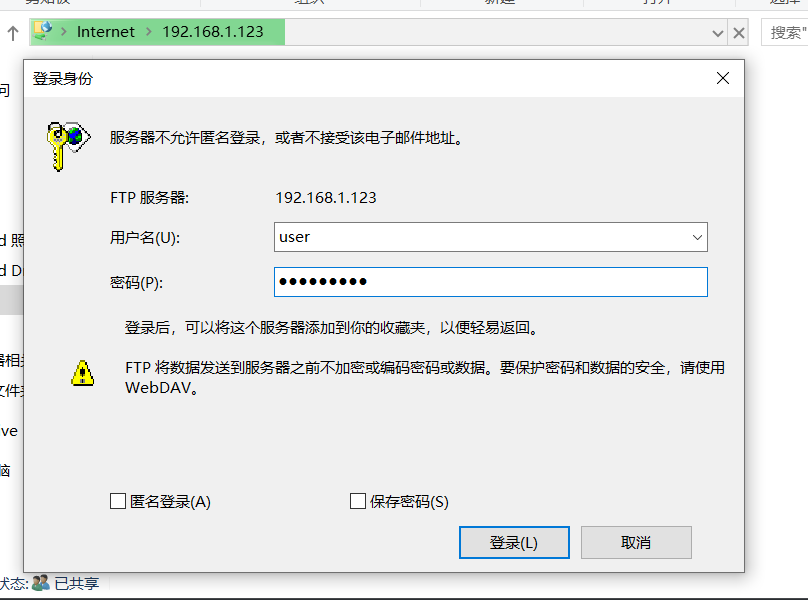
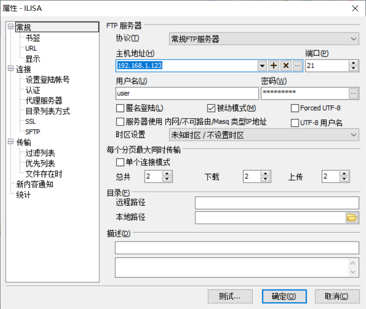
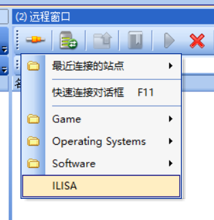
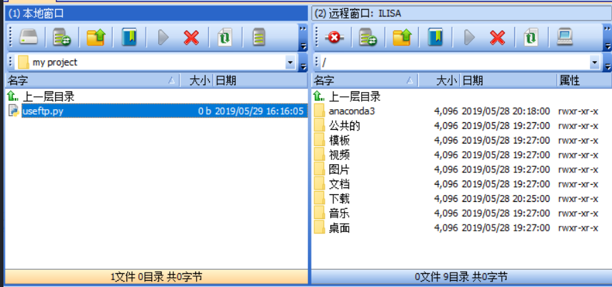
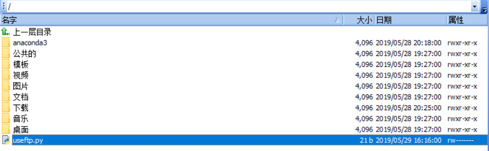

# 2 文件传输服务

ILISA 服务器使用了开启了基于文件传输协议（File Transfer Protocol，FTP）的传输服务，基于此协议，用户可以快速地在本地主机和服务器之间上传与下载文件。通过此服务，您可以便捷上传您的程序、数据集以及其它内容。

## 2.1 在 Windows 文件资源管理器使用 FTP 服务

在 Windows 文件资源管理器地址栏输入：

```
ftp://192.168.1.123
```

> 注：使用公网访问时替换公网 IP

服务器此时会要求用户名和密码，在 ILISA 服务器上，**FTP 服务的用户名密码与使用 SSH 登录时的密码一致**：



输入用户名和密码后，可以使用与访问资源管理器相同的方式访问您在服务器上的用户主目录：


## 2.2 通过专业 FTP 传输工具使用 FTP 服务

通过 Windows 资源管理器访问 FTP 服务，可能会存在传输速度慢、连接不稳定的问题。为了让您获得更好的体验，推荐您使用第三方的 FTP 传输工具（如 FTPRush、Xftp、FlashFXP）。

以 FTPRush 为例，在站点管理窗口配置好 IP地址、端口、用户名及密码：



在远程窗口连接菜单选择配置完成的服务器，即可连接：



## 2.3 文件上传示例

FTP 工具一般分为远程窗口和本地窗口，分布在左右两侧。本地窗口可以访问主机上的文件，远程窗口可以访问服务器上的文件，两侧文件可以互相传输。如果两侧都是本地窗口或两侧都是远程窗口，请寻找其中一侧的切换按钮以切换本地/远程模式。

以 FTPRush 为例，找到需要上传的本地文件，点击传输按钮或者右键传输到服务器上的目标目录：



传输完成后，文件将出现在远程窗口目标目录下：



此时通过 SSH 访问目标目录，即可访问或运行文件：

``` shell
cd ~
python useftp.py
```

\# Out [1]:

> Hello World !